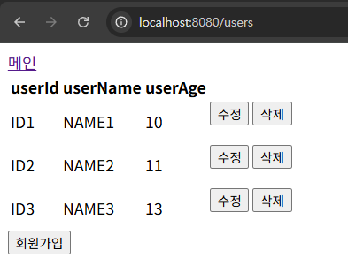

# dd_assignment
KAKAO X GOORM DEEP DIVE_ASSIGNMENT

### 프로젝트 구조
src/main/java/introduction/spring_introduction/
- aop : AOP 테스트
- hello : RestController 테스트("Hello, World" 반환)
- user : 회원정보 관리

src/main/webapp/WEB-INF/views/
- user : 회원정보 리스트 & 회원정보 삭제
- new-form : 회원정보 생성
- udp-form : 회원정보 수정

### RestController 테스트
- Hello, World 테스트
- helloController.java

### 회원 정보 관리 디렉토리 구조
- controller : 컨트롤러
  - UserController.java
- entity : 회원정보
  - User.java
- repository : JPA 연결
  - UserRepository.java
- service : 비즈니스 로직
  - UserService.java
  - UserServiceImpl.java

[회원 정보 조회]  
  
  

[회원 정보 저장]  
  
  
  

[회원 정보 수정]  
  
  
  

[회원 정보 삭제]  
  
  

### AOP 테스트

